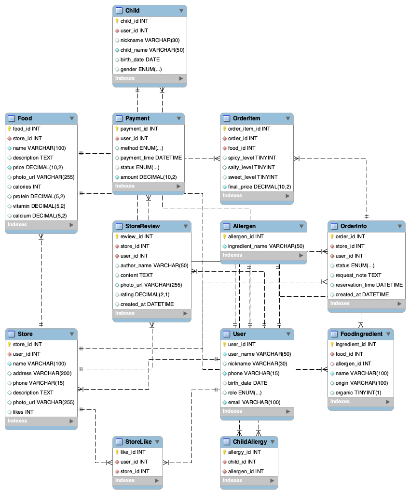

## [주제 : 음식 배달 APP]

## [유저 페르소나]

**유저 타겟:** 5~12살 자녀 및 반려동물이 있는 30~40대 맞벌이 부부.

**유저 니즈:** 안심하고 먹을 수 있는 음식 배달 서비스 플랫폼.

<aside>
⚙

**[자녀가 있는 어머니가 원하는 것]**

- 식재료의 **신선도 및 원산지 확인**
- 음식의 **간 정도(짜지 않음 등) 조절**
- **영양 균형** 및 건강 고려
- 음식의 **분량 및 사이즈 적정성**
</aside>

## [사용 흐름]

시작 → 앱 진입 → 메뉴 고민 → 메뉴 상세 확인(메뉴 종류) → 옵션 확인(알러지 ,음식 간 세기, 재료) → 영양 정보 확인 → 가게 선택 → 예약여부 → 주문 결제 → 배달 수령 및 식사 → 리뷰 남기기 → 끝

<aside>
💡

## **🎯 타겟 유저 프로필**

**이름:** 김하나 (38세)

**가족 구성:** 남편(40세), 초등학교 3학년 아들(9세), 반려견(푸들 1살)

**직업:** IT 회사 마케팅 매니저 (재택 + 출근 병행)

**거주:** 서울 송파구

**소득 수준:** 중상 (월 가계 소득 약 700만원)

**생활 패턴:**

- 오전 8시 출근, 오후 6시 퇴근
- 아이 하교 시간은 오후 3시, 주로 조부모님이 잠시 봐주심
- 주말엔 가족끼리 외식 또는 반려견 산책

---

## **🧩 문제 상황 (Pain Point)**

- 퇴근 후 **요리할 시간**이 거의 없고,
- 대부분 배달앱을 사용하지만 **짜고 기름진 음식** 위주라 아이에게 주기 불안함
- “아이 반찬용으로 건강한 음식”을 시키고 싶지만,
    
    메뉴 설명엔 **영양정보나 원산지 표시가 불충분**
    
- 반려견 전용 간식도 함께 주문하고 싶지만 **한 플랫폼에서 한 번에 주문 불가**

---

## **💡 해결 아이디어 (Needs & Wants)**

김하나는 다음과 같은 기능을 원함:

1. **식재료 신선도 표시**
    
    → 예: “닭고기: 국내산 무항생제”, “야채: 당일 수확” 등 신뢰 가능한 정보 제공
    
2. **간 조절 옵션**
    
    → “저염 / 표준 / 어린이용” 등 선택 가능
    
3. **영양 균형 / 알러지 정보 표시**
    
    → “단백질, 칼슘 풍부”, “우유 성분 없음” 등 표시
    
4. **분량 선택 기능**
    
    → “성인 1인 / 아동 1인 / 가족 2~3인분”
    
5. **반려동물 전용 코너**
    
    → “사람 음식 + 반려견 건강 간식 세트” 같이 묶음 주문 가능
    

---

## **📱 시나리오 예시**

### **1. 퇴근길 지하철에서**

하나는 지하철 안에서 아이 저녁 메뉴를 고민하다가 앱을 켠다.

홈 화면에는 “**아이와 함께 먹는 건강 저녁**” 카테고리가 노출된다.

“닭가슴살 채소볶음(저염/당일조리)”을 선택한다.

하나는 옵션에서 **“저염 + 아동용 1인분”**을 선택한다.

### **2. 상세 페이지**

- “국내산 닭가슴살 (도축일: 오늘)”
- “저염 옵션: 나트륨 30% 감소”
- “영양정보: 단백질 25g, 지방 5g”
- “리뷰: 아이 반찬용으로 좋아요 👍”

신뢰감이 생겨 주문을 확정한다.

### **3. 결제 페이지**

하나는 반려견 간식 코너를 보고 “닭가슴살 트릿(무첨가)”도 함께 담는다.

한 번의 결제로 “**가족+반려견 저녁 세트**” 완성.

배송 예정 시간은 30분 내 — 하나는 도착 알림을 받고 바로 전자레인지에 데운다.

### **4. 식사 후**

앱에서 “오늘 식단 피드백”을 요청한다.

하나는 “짜지 않고 맛있었어요! 아이가 다 먹었어요.”라고 평점을 남긴다.

→ 앱은 다음날 “비슷한 저염 메뉴 추천”을 푸시로 보낸다.

---

## **🌱 기대 효과**

- **사용자 만족도 상승:** 건강/신뢰/편리함 모두 충족
- **재구매율 향상:** 개인 맞춤 추천 기능으로 지속 이용 유도
- **브랜드 이미지 강화:** “아이와 반려동물 모두 안심할 수 있는 음식”

---

</aside>

<aside>
💡

| 요구사항 | 유저 스토리 |
| --- | --- |
| 식재료의 신선도 및 원산지 확인 | **5~12살 아이를 둔 바쁜 워킹맘으로서**, 각 메뉴의 식재료 **신선도(수확일, 보관 조건 등)와 원산지 정보를 쉽게 확인**하고 싶어요. **그래야 가족에게 배달되는 음식의 품질과 안전성을 믿을 수 있거든요.투명성을 중시하는 부모로서**, **원산지(국내산 vs 수입산)와 신선도 등급별로 메뉴를 필터링하거나 검색**할 수 있는 기능을 원해요. **시간이 부족한 와중에도 빠르게 정보에 기반한 선택을 할 수 있게요.** |
| 음식의 간 정도(짜지 않음 등) 조절 | **5~12살 아이를 둔 건강을 생각하는 엄마로서**, 주문 시 **간 정도(저염, 순한 맛 등)를 직접 조절**할 수 있기를 원해요. **아이들 입맛에 맞고 나트륨 과다 섭취 같은 위험을 줄일 수 있으니까요.맞벌이 부모로서**, 앱에 **‘아이 입맛 맞춤’ 간 조절 프리셋 옵션**을 원해요. **커스터마이징 시간을 아끼면서도 너무 짜거나 강하지 않은 식사를 보장받을 수 있으니까요.** |
| 영양 균형 및 건강 고려 | **가족 건강에 집중하는 워킹 부모로서**, **영양 균형(칼로리 분포, 비타민, 알레르기 정보 등)과 건강 이점을 강조한 메뉴 추천**을 원해요. **아이들 성장에 도움이 되는 옵션을 따로 조사할 필요 없이 고를 수 있게요.요리 시간이 부족한 엄마로서**, **아이 연령별 영양 필요량을 기반으로 한 주간 식단 계획 제안 및 추적 도구**를 원해요. **배달이 우리 가족 전체의 웰니스와 영양 결핍 방지에 기여하도록요.** |
| 음식의 분량 및 사이즈 적정성 | **어린 자녀를 위한 분량을 관리하는 부모로서**, 각 메뉴에 **조절 가능한 포션 사이즈(소량/아이용 등)**를 원해요. **낭비를 줄이고 우리 가족 식사량에 딱 맞출 수 있으니까요.아이 또는 반려동물을 둔 바쁜 부부로서**, **연령대별로 확장 가능한 패밀리 번들 옵션(2~4인분 등)**을 원해요. **가구 구성에 정확히 맞춰 배달이 오도록 해 돈과 남는 음식을 줄일 수 있어요.** |
</aside>

<aside>

---

| **상황** | **행동** | **생각 / 감정** | **기회 (Insight & 개선 포인트)** |
| --- | --- | --- | --- |
| **퇴근길 지하철**아이 저녁 메뉴 고민 중 | 기존 배달앱 열어 메뉴 검색 | “다 짜고 자극적인 음식뿐이네…”“아이 먹이기엔 불안하다.” | ✔️ 건강식 / 어린이 메뉴 전용 카테고리 노출✔️ 첫 진입 시 ‘가족 맞춤 추천’ 제공 |
| **앱 홈 진입** | “아이와 함께 먹는 저염 메뉴” 클릭 | “이건 아이랑 같이 먹어도 되겠다!”신뢰감 + 관심 | ✔️ 홈 화면에 ‘연령대별 / 상황별’ 추천 메뉴 큐레이션✔️ ‘신선도 태그’ 시각화 |
| **메뉴 상세 확인** | 원산지, 영양정보, 간조절 옵션 확인 | “국내산이네. 믿음이 간다.”“저염 옵션도 있네, 좋다!” | ✔️ 식재료 원산지·유통일 표시 강화✔️ ‘영양 균형 점수’ 시각화로 신뢰도 향상 |
| **주문 결정 및 결제** | ‘아동용 1인분 + 반려견 간식’ 함께 주문 | “이렇게 한 번에 주문되니까 편하네.” | ✔️ ‘가족+반려동물 세트 메뉴’ 제안✔️ 결제 전 “오늘의 식단 완성 팁” 추천 |
| **배달 수령 및 식사 후** | 앱 피드백 요청에 별점 작성 | “짜지 않고 맛있었어.”“다음에도 주문해야지.” | ✔️ 후기 기반 맞춤 재추천✔️ 사용자 후기 중 “아이 반응” 강조 리뷰 구분 |
| **다음날 점심 시간** | 푸시 알림: “비슷한 메뉴 추천” | “어제 좋았는데 또 시켜볼까?” | ✔️ 개인 맞춤 재주문 자동화✔️ 구독형 ‘건강식 플랜’ |
|  |  |  |  |
</aside>

---
## 등록 쿼리문
-- [1] 사용자 테이블
CREATE TABLE User (
  user_id INT AUTO_INCREMENT PRIMARY KEY,
  user_name VARCHAR(50) NOT NULL,
  nickname VARCHAR(30),
  phone VARCHAR(15) UNIQUE NOT NULL,
  birth_date DATE,
  role ENUM('부모', '사장', '관리자') DEFAULT '부모',
  email VARCHAR(100) UNIQUE NOT NULL
);

-- [2] 자녀 테이블
CREATE TABLE Child (
  child_id INT AUTO_INCREMENT PRIMARY KEY,
  user_id INT NOT NULL,
  nickname VARCHAR(30),
  child_name VARCHAR(50) NOT NULL,
  birth_date DATE,
  gender ENUM('남아', '여아'),
  FOREIGN KEY (user_id) REFERENCES User(user_id) ON DELETE CASCADE
);

-- [3] 알러지 유발 물질
CREATE TABLE Allergen (
  allergen_id INT AUTO_INCREMENT PRIMARY KEY,
  ingredient_name VARCHAR(50) NOT NULL
);

-- [4] 자녀 알러지 매핑
CREATE TABLE ChildAllergy (
  allergy_id INT AUTO_INCREMENT PRIMARY KEY,
  child_id INT NOT NULL,
  allergen_id INT NOT NULL,
  FOREIGN KEY (child_id) REFERENCES Child(child_id) ON DELETE CASCADE,
  FOREIGN KEY (allergen_id) REFERENCES Allergen(allergen_id) ON DELETE CASCADE
);

-- [5] 가게
CREATE TABLE Store (
  store_id INT AUTO_INCREMENT PRIMARY KEY,
  user_id INT NOT NULL,
  name VARCHAR(100) NOT NULL,
  address VARCHAR(200),
  phone VARCHAR(15),
  description TEXT,
  photo_url VARCHAR(255),
  likes INT DEFAULT 0,
  FOREIGN KEY (user_id) REFERENCES User(user_id) ON DELETE CASCADE
);

-- [6] 가게 찜
CREATE TABLE StoreLike (
  like_id INT AUTO_INCREMENT PRIMARY KEY,
  user_id INT NOT NULL,
  store_id INT NOT NULL,
  UNIQUE (user_id, store_id),
  FOREIGN KEY (user_id) REFERENCES User(user_id) ON DELETE CASCADE,
  FOREIGN KEY (store_id) REFERENCES Store(store_id) ON DELETE CASCADE
);

-- [7] 가게 리뷰
CREATE TABLE StoreReview (
  review_id INT AUTO_INCREMENT PRIMARY KEY,
  store_id INT NOT NULL,
  user_id INT NOT NULL,
  author_name VARCHAR(50),
  content TEXT,
  photo_url VARCHAR(255),
  rating DECIMAL(2,1) CHECK (rating >= 0 AND rating <= 5),
  created_at DATETIME DEFAULT CURRENT_TIMESTAMP,
  FOREIGN KEY (store_id) REFERENCES Store(store_id) ON DELETE CASCADE,
  FOREIGN KEY (user_id) REFERENCES User(user_id) ON DELETE CASCADE
);

-- [8] 음식
CREATE TABLE Food (
  food_id INT AUTO_INCREMENT PRIMARY KEY,
  store_id INT NOT NULL,
  name VARCHAR(100) NOT NULL,
  description TEXT,
  price DECIMAL(10,2) NOT NULL,
  photo_url VARCHAR(255),
  calories INT,
  protein DECIMAL(5,2),
  vitamin DECIMAL(5,2),
  calcium DECIMAL(5,2),
  FOREIGN KEY (store_id) REFERENCES Store(store_id) ON DELETE CASCADE
);

-- [9] 실제 음식 재료
CREATE TABLE FoodIngredient (
  ingredient_id INT AUTO_INCREMENT PRIMARY KEY,
  food_id INT NOT NULL,
  allergen_id INT,
  name VARCHAR(100) NOT NULL,
  origin VARCHAR(100),
  organic BOOLEAN DEFAULT FALSE,
  FOREIGN KEY (food_id) REFERENCES Food(food_id) ON DELETE CASCADE,
  FOREIGN KEY (allergen_id) REFERENCES Allergen(allergen_id)
);

-- [10] 주문정보
CREATE TABLE OrderInfo (
  order_id INT AUTO_INCREMENT PRIMARY KEY,
  store_id INT NOT NULL,
  user_id INT NOT NULL,
  status ENUM('주문대기', '조리중', '배달중', '완료', '취소') DEFAULT '주문대기',
  request_note TEXT,
  reservation_time DATETIME,
  created_at DATETIME DEFAULT CURRENT_TIMESTAMP,
  FOREIGN KEY (store_id) REFERENCES Store(store_id) ON DELETE CASCADE,
  FOREIGN KEY (user_id) REFERENCES User(user_id) ON DELETE CASCADE
);

-- [11] 주문 음식
CREATE TABLE OrderItem (
  order_item_id INT AUTO_INCREMENT PRIMARY KEY,
  order_id INT NOT NULL,
  food_id INT NOT NULL,
  spicy_level TINYINT CHECK (spicy_level BETWEEN 0 AND 5),
  salty_level TINYINT CHECK (salty_level BETWEEN 0 AND 5),
  sweet_level TINYINT CHECK (sweet_level BETWEEN 0 AND 5),
  final_price DECIMAL(10,2) NOT NULL,
  FOREIGN KEY (order_id) REFERENCES OrderInfo(order_id) ON DELETE CASCADE,
  FOREIGN KEY (food_id) REFERENCES Food(food_id)
);

-- [12] 결제
CREATE TABLE Payment (
  payment_id INT AUTO_INCREMENT PRIMARY KEY,
  user_id INT NOT NULL,
  method ENUM('카드', '현금', '포인트', '간편결제'),
  payment_time DATETIME DEFAULT CURRENT_TIMESTAMP,
  status ENUM('성공', '실패', '취소') DEFAULT '성공',
  amount DECIMAL(10,2) NOT NULL,
  FOREIGN KEY (user_id) REFERENCES User(user_id)
);

-- ----------------------------------------------------------------------

